# Detailed Flow Documentation - PureLedger Services

This document provides comprehensive flow diagrams and business logic details for each service component.

---

## Table of Contents

1. [SharedProcessingService - Detailed Flows](#sharedprocessingservice)
2. [JournalEntryService - Detailed Flows](#journalentryservice)
3. [DeliveryChallanService - Detailed Flows](#deliverychallanservice)
4. [Voucher Reference System](#voucher-reference-system)
5. [State Transition Diagrams](#state-transitions)

---

## SharedProcessingService

### Entry Processing State Determination

**Method:** `DetermineEntryProcessedStatusAsync(JournalEntry entry)`

**Purpose:** Determines if a journal entry should be marked as processed based on account group and quantity.

**Detailed Flow:**

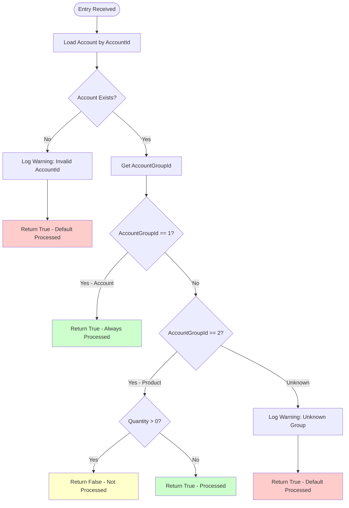
```mermaid
flowchart TD
    Start([Entry Received]) --> LoadAccount[Load Account by AccountId]
    LoadAccount --> AccountExists{Account Exists?}
    AccountExists -->|No| LogWarning[Log Warning: Invalid AccountId]
    LogWarning --> ReturnTrue1[Return True - Default Processed]
    AccountExists -->|Yes| GetGroup[Get AccountGroupId]
    GetGroup --> CheckGroup{AccountGroupId == 1?}
    CheckGroup -->|Yes - Account| ReturnTrue2[Return True - Always Processed]
    CheckGroup -->|No| CheckProduct{AccountGroupId == 2?}
    CheckProduct -->|Yes - Product| CheckQuantity{Quantity > 0?}
    CheckQuantity -->|Yes| ReturnFalse[Return False - Not Processed]
    CheckQuantity -->|No| ReturnTrue3[Return True - Processed]
    CheckProduct -->|Unknown| LogWarning2[Log Warning: Unknown Group]
    LogWarning2 --> ReturnTrue4[Return True - Default Processed]
    
    style ReturnTrue1 fill:#ffcccc
    style ReturnTrue2 fill:#ccffcc
    style ReturnTrue3 fill:#ccffcc
    style ReturnTrue4 fill:#ffcccc
    style ReturnFalse fill:#ffffcc
```

**Business Rules:**
- **Account Group 1 (Account):** Always processed, regardless of quantity
- **Account Group 2 (Product):** Processed only when quantity <= 0
- **Invalid/Unknown:** Defaults to processed (safe fallback)

**Code Logic:**
```csharp
if (accountGroupId == ACCOUNT_GROUP_ACCOUNT) return true;
if (accountGroupId == ACCOUNT_GROUP_PRODUCT) return entry.Quantity <= 0;
return true; // Fallback
```

---

### Voucher Completion Recalculation

**Method:** `RecalculateVoucherCompletionAsync(int journalVoucherId)`

**Purpose:** Recalculates voucher completion status and handles state transitions.

**Detailed Flow:**

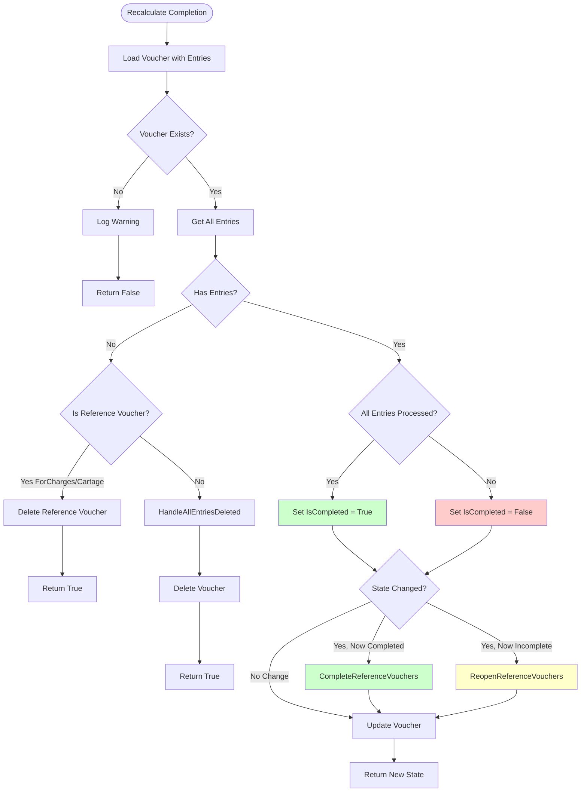
```mermaid
flowchart TD
    Start([Recalculate Completion]) --> LoadVoucher[Load Voucher with Entries]
    LoadVoucher --> VoucherExists{Voucher Exists?}
    VoucherExists -->|No| LogWarning[Log Warning]
    LogWarning --> ReturnFalse[Return False]
    VoucherExists -->|Yes| GetEntries[Get All Entries]
    GetEntries --> HasEntries{Has Entries?}
    HasEntries -->|No| CheckRefVoucher{Is Reference Voucher?}
    CheckRefVoucher -->|Yes ForCharges/Cartage| DeleteRef[Delete Reference Voucher]
    DeleteRef --> ReturnTrue1[Return True]
    CheckRefVoucher -->|No| HandleEmpty[HandleAllEntriesDeleted]
    HandleEmpty --> DeleteVoucher[Delete Voucher]
    DeleteVoucher --> ReturnTrue2[Return True]
    HasEntries -->|Yes| CheckAllProcessed{All Entries Processed?}
    CheckAllProcessed -->|Yes| SetCompleted[Set IsCompleted = True]
    CheckAllProcessed -->|No| SetIncomplete[Set IsCompleted = False]
    SetCompleted --> StateChanged{State Changed?}
    SetIncomplete --> StateChanged
    StateChanged -->|Yes, Now Completed| CompleteRefs[CompleteReferenceVouchers]
    StateChanged -->|Yes, Now Incomplete| ReopenRefs[ReopenReferenceVouchers]
    StateChanged -->|No Change| UpdateVoucher[Update Voucher]
    CompleteRefs --> UpdateVoucher
    ReopenRefs --> UpdateVoucher
    UpdateVoucher --> ReturnNewState[Return New State]
    
    style SetCompleted fill:#ccffcc
    style SetIncomplete fill:#ffcccc
    style CompleteRefs fill:#ccffcc
    style ReopenRefs fill:#ffffcc
```

**State Transition Logic:**

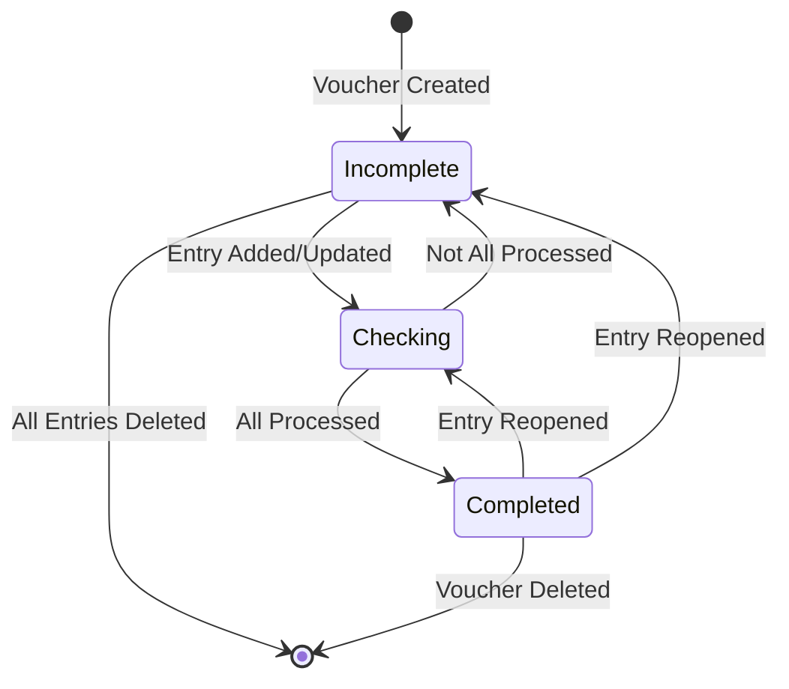
```mermaid
stateDiagram-v2
    [*] --> Incomplete: Voucher Created
    Incomplete --> Checking: Entry Added/Updated
    Checking --> Incomplete: Not All Processed
    Checking --> Completed: All Processed
    Completed --> Checking: Entry Reopened
    Completed --> Incomplete: Entry Reopened
    Incomplete --> [*]: All Entries Deleted
    Completed --> [*]: Voucher Deleted
```

**Reference Voucher Cascading:**

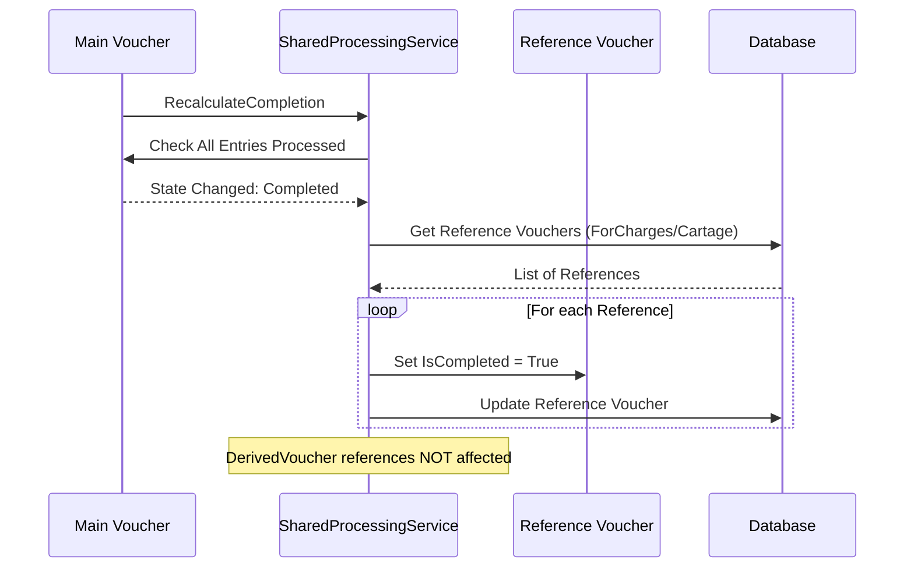
```mermaid
sequenceDiagram
    participant Main as Main Voucher
    participant SPS as SharedProcessingService
    participant Ref as Reference Voucher
    participant DB as Database
    
    Main->>SPS: RecalculateCompletion
    SPS->>Main: Check All Entries Processed
    Main-->>SPS: State Changed: Completed
    SPS->>DB: Get Reference Vouchers (ForCharges/Cartage)
    DB-->>SPS: List of References
    loop For each Reference
        SPS->>Ref: Set IsCompleted = True
        SPS->>DB: Update Reference Voucher
    end
    Note over SPS: DerivedVoucher references NOT affected
```

---

## JournalEntryService

### Voucher Creation Flow

**Method:** `CreateJournalVoucherAsync(JournalEntryViewModel model)`

**Complete Sequence:**

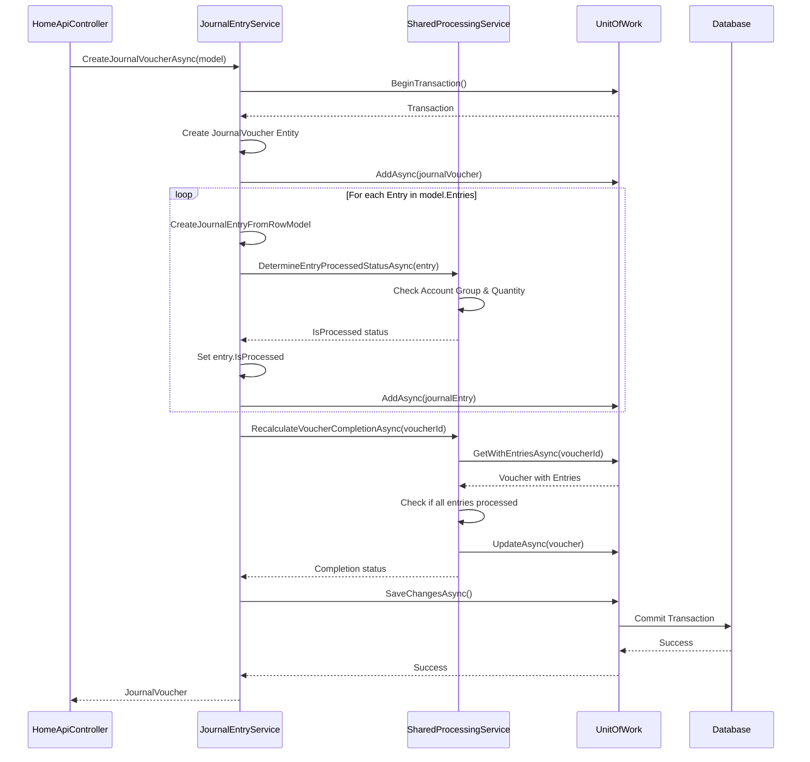
```mermaid
sequenceDiagram
    participant API as HomeApiController
    participant JES as JournalEntryService
    participant SPS as SharedProcessingService
    participant UOW as UnitOfWork
    participant DB as Database
    
    API->>JES: CreateJournalVoucherAsync(model)
    JES->>UOW: BeginTransaction()
    UOW-->>JES: Transaction
    
    JES->>JES: Create JournalVoucher Entity
    JES->>UOW: AddAsync(journalVoucher)
    
    loop For each Entry in model.Entries
        JES->>JES: CreateJournalEntryFromRowModel
        JES->>SPS: DetermineEntryProcessedStatusAsync(entry)
        SPS->>SPS: Check Account Group & Quantity
        SPS-->>JES: IsProcessed status
        JES->>JES: Set entry.IsProcessed
        JES->>UOW: AddAsync(journalEntry)
    end
    
    JES->>SPS: RecalculateVoucherCompletionAsync(voucherId)
    SPS->>UOW: GetWithEntriesAsync(voucherId)
    UOW-->>SPS: Voucher with Entries
    SPS->>SPS: Check if all entries processed
    SPS->>UOW: UpdateAsync(voucher)
    SPS-->>JES: Completion status
    
    JES->>UOW: SaveChangesAsync()
    UOW->>DB: Commit Transaction
    DB-->>UOW: Success
    UOW-->>JES: Success
    JES-->>API: JournalVoucher
```

**Entry Creation Logic:**

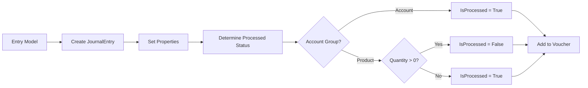
```mermaid
flowchart LR
    A[Entry Model] --> B[Create JournalEntry]
    B --> C[Set Properties]
    C --> D[Determine Processed Status]
    D --> E{Account Group?}
    E -->|Account| F[IsProcessed = True]
    E -->|Product| G{Quantity > 0?}
    G -->|Yes| H[IsProcessed = False]
    G -->|No| I[IsProcessed = True]
    F --> J[Add to Voucher]
    H --> J
    I --> J
```

---

### Entry Update Flow

**Method:** `UpdateJournalEntryAsync(JournalEntryUpdateViewModel model)`

**Complex State Transition Logic:**

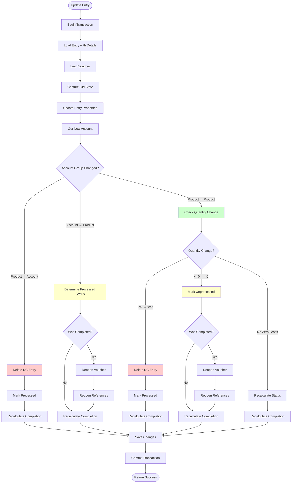
```mermaid
flowchart TD
    Start([Update Entry]) --> BeginTx[Begin Transaction]
    BeginTx --> LoadEntry[Load Entry with Details]
    LoadEntry --> LoadVoucher[Load Voucher]
    LoadVoucher --> CaptureOld[Capture Old State]
    CaptureOld --> UpdateProps[Update Entry Properties]
    UpdateProps --> GetNewAccount[Get New Account]
    GetNewAccount --> CheckChange{Account Group Changed?}
    
    CheckChange -->|Product → Account| Path1[Delete DC Entry]
    Path1 --> MarkProcessed1[Mark Processed]
    MarkProcessed1 --> Recalc1[Recalculate Completion]
    
    CheckChange -->|Account → Product| Path2[Determine Processed Status]
    Path2 --> CheckWasCompleted{Was Completed?}
    CheckWasCompleted -->|Yes| ReopenVoucher[Reopen Voucher]
    ReopenVoucher --> ReopenRefs[Reopen References]
    CheckWasCompleted -->|No| Recalc2[Recalculate Completion]
    ReopenRefs --> Recalc2
    
    CheckChange -->|Product → Product| Path3[Check Quantity Change]
    Path3 --> QtyChange{Quantity Change?}
    QtyChange -->|>0 → <=0| Path4[Delete DC Entry]
    Path4 --> MarkProcessed2[Mark Processed]
    MarkProcessed2 --> Recalc3[Recalculate Completion]
    QtyChange -->|<=0 → >0| Path5[Mark Unprocessed]
    Path5 --> CheckWasCompleted2{Was Completed?}
    CheckWasCompleted2 -->|Yes| ReopenVoucher2[Reopen Voucher]
    ReopenVoucher2 --> ReopenRefs2[Reopen References]
    CheckWasCompleted2 -->|No| Recalc4[Recalculate Completion]
    ReopenRefs2 --> Recalc4
    QtyChange -->|No Zero Cross| Path6[Recalculate Status]
    Path6 --> Recalc5[Recalculate Completion]
    
    Recalc1 --> SaveChanges[Save Changes]
    Recalc2 --> SaveChanges
    Recalc3 --> SaveChanges
    Recalc4 --> SaveChanges
    Recalc5 --> SaveChanges
    SaveChanges --> Commit[Commit Transaction]
    Commit --> End([Return Success])
    
    style Path1 fill:#ffcccc
    style Path2 fill:#ffffcc
    style Path3 fill:#ccffcc
    style Path4 fill:#ffcccc
    style Path5 fill:#ffffcc
```

**Account Group Transition Matrix:**

| From | To | Action | DC Entry | Processed Status | Voucher State |
|------|----|--------|----------|------------------|---------------|
| Product | Account | Delete DC | Deleted | True | Recalculate |
| Account | Product | Determine | N/A | Based on Qty | Reopen if was completed |
| Product | Product | Check Qty | Delete if Qty<=0 | Based on Qty | Reopen if Qty>0 and was completed |

---

### Derived Voucher Creation

**Method:** `CreateDerivedVoucherAsync(...)`

**Decision Tree:**

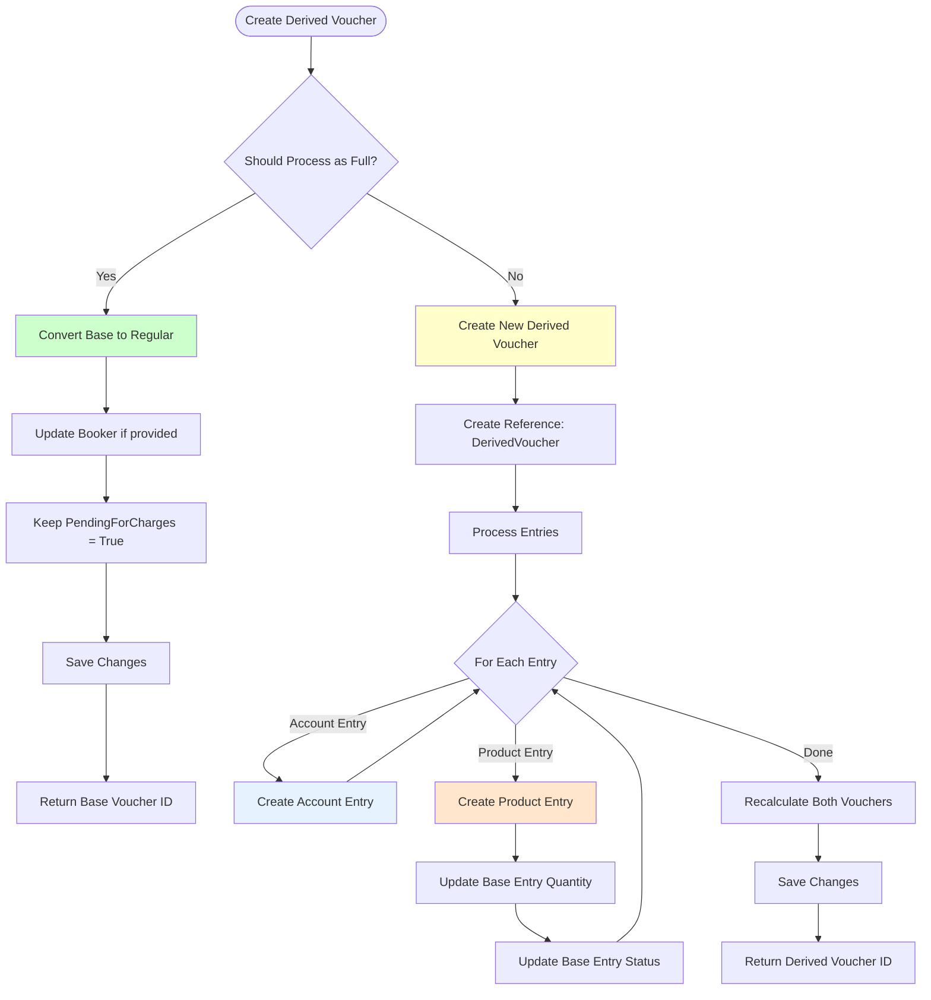
```mermaid
flowchart TD
    Start([Create Derived Voucher]) --> CheckFull{Should Process as Full?}
    CheckFull -->|Yes| Convert[Convert Base to Regular]
    Convert --> UpdateBooker[Update Booker if provided]
    UpdateBooker --> KeepPending[Keep PendingForCharges = True]
    KeepPending --> Save1[Save Changes]
    Save1 --> ReturnBase[Return Base Voucher ID]
    
    CheckFull -->|No| CreateNew[Create New Derived Voucher]
    CreateNew --> CreateRef[Create Reference: DerivedVoucher]
    CreateRef --> ProcessEntries[Process Entries]
    
    ProcessEntries --> Loop{For Each Entry}
    Loop -->|Account Entry| CreateAccount[Create Account Entry]
    CreateAccount --> Loop
    Loop -->|Product Entry| CreateProduct[Create Product Entry]
    CreateProduct --> UpdateBaseQty[Update Base Entry Quantity]
    UpdateBaseQty --> UpdateBaseStatus[Update Base Entry Status]
    UpdateBaseStatus --> Loop
    
    Loop -->|Done| RecalcBoth[Recalculate Both Vouchers]
    RecalcBoth --> Save2[Save Changes]
    Save2 --> ReturnDerived[Return Derived Voucher ID]
    
    style Convert fill:#ccffcc
    style CreateNew fill:#ffffcc
    style CreateAccount fill:#e6f3ff
    style CreateProduct fill:#ffe6cc
```

**Full Processing Check Logic:**

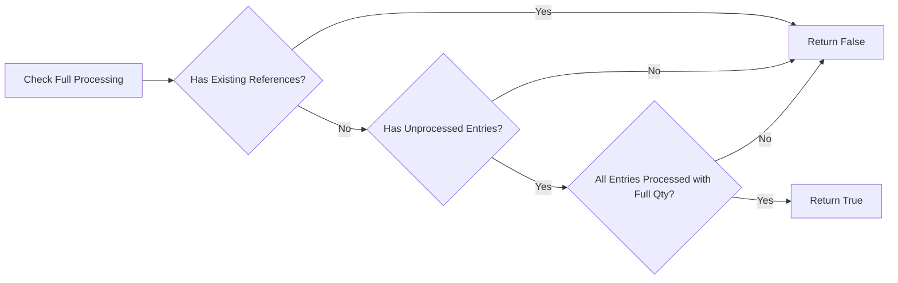
```mermaid
flowchart LR
    A[Check Full Processing] --> B{Has Existing References?}
    B -->|Yes| C[Return False]
    B -->|No| D{Has Unprocessed Entries?}
    D -->|No| C
    D -->|Yes| E{All Entries Processed with Full Qty?}
    E -->|Yes| F[Return True]
    E -->|No| C
```

---

## DeliveryChallanService

### Single Entry Processing

**Method:** `CreateSingleDeliveryChallanAsync(...)`

**Complete Flow:**

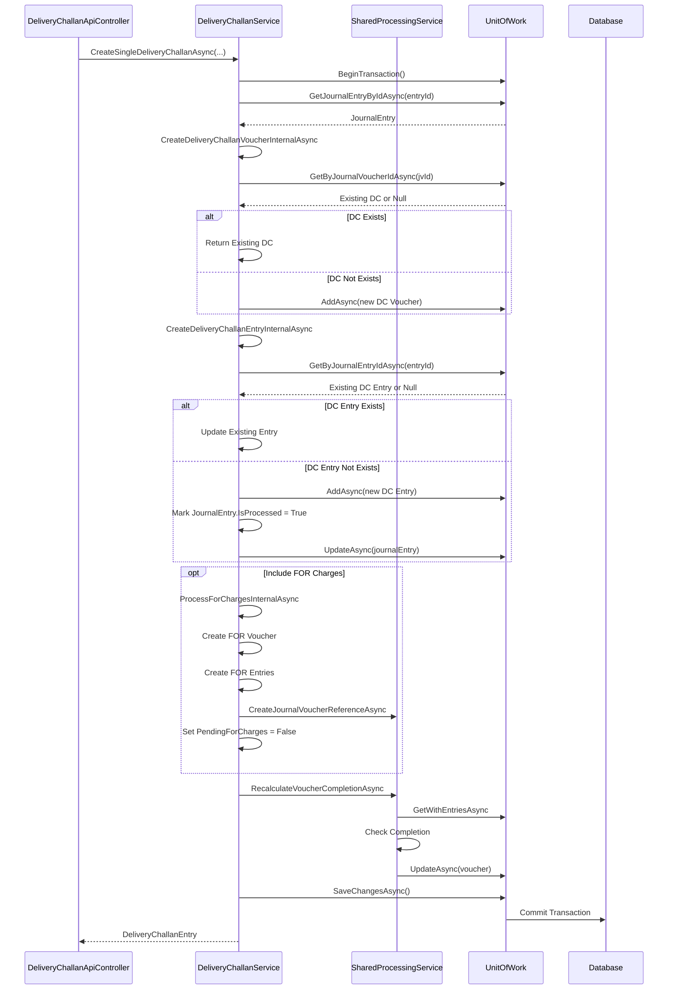
```mermaid
sequenceDiagram
    participant API as DeliveryChallanApiController
    participant DCS as DeliveryChallanService
    participant SPS as SharedProcessingService
    participant UOW as UnitOfWork
    participant DB as Database
    
    API->>DCS: CreateSingleDeliveryChallanAsync(...)
    DCS->>UOW: BeginTransaction()
    
    DCS->>UOW: GetJournalEntryByIdAsync(entryId)
    UOW-->>DCS: JournalEntry
    
    DCS->>DCS: CreateDeliveryChallanVoucherInternalAsync
    DCS->>UOW: GetByJournalVoucherIdAsync(jvId)
    UOW-->>DCS: Existing DC or Null
    alt DC Exists
        DCS->>DCS: Return Existing DC
    else DC Not Exists
        DCS->>UOW: AddAsync(new DC Voucher)
    end
    
    DCS->>DCS: CreateDeliveryChallanEntryInternalAsync
    DCS->>UOW: GetByJournalEntryIdAsync(entryId)
    UOW-->>DCS: Existing DC Entry or Null
    alt DC Entry Exists
        DCS->>DCS: Update Existing Entry
    else DC Entry Not Exists
        DCS->>UOW: AddAsync(new DC Entry)
        DCS->>DCS: Mark JournalEntry.IsProcessed = True
        DCS->>UOW: UpdateAsync(journalEntry)
    end
    
    opt Include FOR Charges
        DCS->>DCS: ProcessForChargesInternalAsync
        DCS->>DCS: Create FOR Voucher
        DCS->>DCS: Create FOR Entries
        DCS->>SPS: CreateJournalVoucherReferenceAsync
        DCS->>DCS: Set PendingForCharges = False
    end
    
    DCS->>SPS: RecalculateVoucherCompletionAsync
    SPS->>UOW: GetWithEntriesAsync
    SPS->>SPS: Check Completion
    SPS->>UOW: UpdateAsync(voucher)
    
    DCS->>UOW: SaveChangesAsync()
    UOW->>DB: Commit Transaction
    DCS-->>API: DeliveryChallanEntry
```

---

### Batch Processing Flow

**Method:** `ProcessBatchDeliveryChallanAsync(...)`

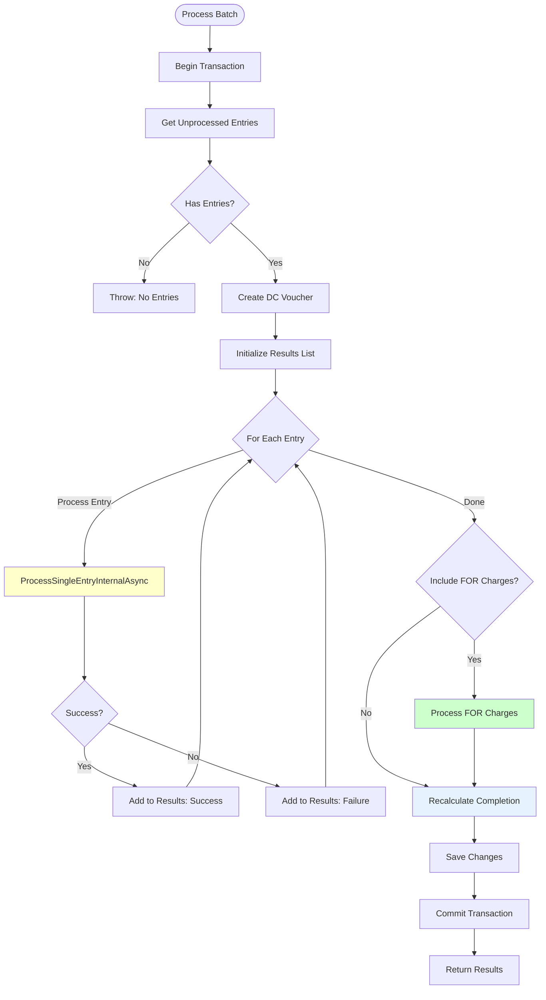
```mermaid
flowchart TD
    Start([Process Batch]) --> BeginTx[Begin Transaction]
    BeginTx --> GetUnprocessed[Get Unprocessed Entries]
    GetUnprocessed --> HasEntries{Has Entries?}
    HasEntries -->|No| Error1[Throw: No Entries]
    HasEntries -->|Yes| CreateDC[Create DC Voucher]
    CreateDC --> InitResults[Initialize Results List]
    InitResults --> Loop{For Each Entry}
    Loop -->|Process Entry| ProcessSingle[ProcessSingleEntryInternalAsync]
    ProcessSingle --> CheckSuccess{Success?}
    CheckSuccess -->|Yes| AddSuccess[Add to Results: Success]
    CheckSuccess -->|No| AddFailure[Add to Results: Failure]
    AddSuccess --> Loop
    AddFailure --> Loop
    Loop -->|Done| CheckFOR{Include FOR Charges?}
    CheckFOR -->|Yes| ProcessFOR[Process FOR Charges]
    CheckFOR -->|No| Recalc[Recalculate Completion]
    ProcessFOR --> Recalc
    Recalc --> SaveChanges[Save Changes]
    SaveChanges --> Commit[Commit Transaction]
    Commit --> ReturnResults[Return Results]
    
    style ProcessSingle fill:#ffffcc
    style ProcessFOR fill:#ccffcc
    style Recalc fill:#e6f3ff
```

---

### Cartage Processing Flow

**Method:** `ProcessCartageAndDeliveryAsync(CartageViewModel)`

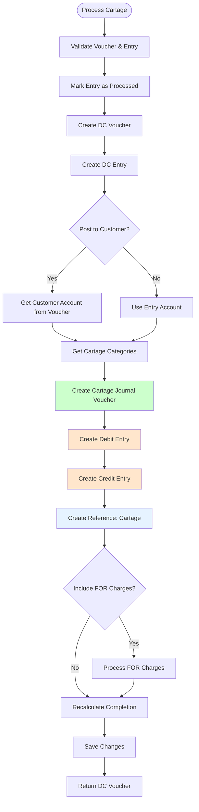
```mermaid
flowchart TD
    Start([Process Cartage]) --> Validate[Validate Voucher & Entry]
    Validate --> MarkProcessed[Mark Entry as Processed]
    MarkProcessed --> CreateDC[Create DC Voucher]
    CreateDC --> CreateDCEntry[Create DC Entry]
    CreateDCEntry --> CheckPost{Post to Customer?}
    CheckPost -->|Yes| GetCustomer[Get Customer Account from Voucher]
    CheckPost -->|No| UseEntry[Use Entry Account]
    GetCustomer --> GetCategories[Get Cartage Categories]
    UseEntry --> GetCategories
    GetCategories --> CreateCartageJV[Create Cartage Journal Voucher]
    CreateCartageJV --> CreateDebit[Create Debit Entry]
    CreateDebit --> CreateCredit[Create Credit Entry]
    CreateCredit --> CreateRef[Create Reference: Cartage]
    CreateRef --> CheckFOR{Include FOR Charges?}
    CheckFOR -->|Yes| ProcessFOR[Process FOR Charges]
    CheckFOR -->|No| Recalc[Recalculate Completion]
    ProcessFOR --> Recalc
    Recalc --> Save[Save Changes]
    Save --> Return[Return DC Voucher]
    
    style CreateCartageJV fill:#ccffcc
    style CreateDebit fill:#ffe6cc
    style CreateCredit fill:#ffe6cc
    style CreateRef fill:#e6f3ff
```

**Account Selection Logic:**

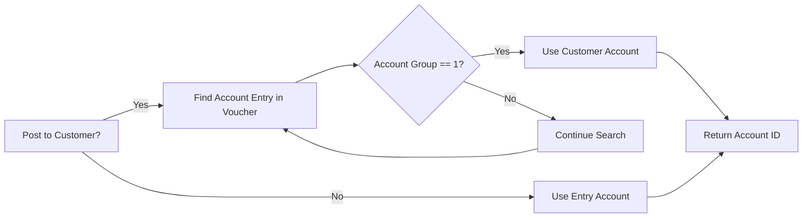
```mermaid
flowchart LR
    A[Post to Customer?] -->|Yes| B[Find Account Entry in Voucher]
    B --> C{Account Group == 1?}
    C -->|Yes| D[Use Customer Account]
    C -->|No| E[Continue Search]
    E --> B
    A -->|No| F[Use Entry Account]
    D --> G[Return Account ID]
    F --> G
```

---

### FOR Charges Processing Flow

**Method:** `ProcessForChargesInternalAsync(...)`

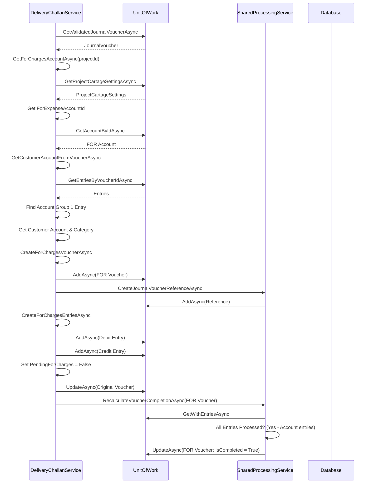
```mermaid
sequenceDiagram
    participant DCS as DeliveryChallanService
    participant UOW as UnitOfWork
    participant SPS as SharedProcessingService
    participant DB as Database
    
    DCS->>UOW: GetValidatedJournalVoucherAsync
    UOW-->>DCS: JournalVoucher
    
    DCS->>DCS: GetForChargesAccountAsync(projectId)
    DCS->>UOW: GetProjectCartageSettingsAsync
    UOW-->>DCS: ProjectCartageSettings
    DCS->>DCS: Get ForExpenseAccountId
    DCS->>UOW: GetAccountByIdAsync
    UOW-->>DCS: FOR Account
    
    DCS->>DCS: GetCustomerAccountFromVoucherAsync
    DCS->>UOW: GetEntriesByVoucherIdAsync
    UOW-->>DCS: Entries
    DCS->>DCS: Find Account Group 1 Entry
    DCS->>DCS: Get Customer Account & Category
    
    DCS->>DCS: CreateForChargesVoucherAsync
    DCS->>UOW: AddAsync(FOR Voucher)
    
    DCS->>SPS: CreateJournalVoucherReferenceAsync
    SPS->>UOW: AddAsync(Reference)
    
    DCS->>DCS: CreateForChargesEntriesAsync
    DCS->>UOW: AddAsync(Debit Entry)
    DCS->>UOW: AddAsync(Credit Entry)
    
    DCS->>DCS: Set PendingForCharges = False
    DCS->>UOW: UpdateAsync(Original Voucher)
    
    DCS->>SPS: RecalculateVoucherCompletionAsync(FOR Voucher)
    SPS->>UOW: GetWithEntriesAsync
    SPS->>SPS: All Entries Processed? (Yes - Account entries)
    SPS->>UOW: UpdateAsync(FOR Voucher: IsCompleted = True)
```

**FOR Charges Entry Creation:**

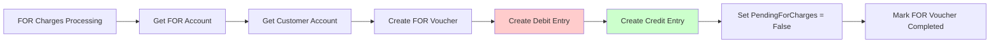
```mermaid
flowchart LR
    A[FOR Charges Processing] --> B[Get FOR Account]
    B --> C[Get Customer Account]
    C --> D[Create FOR Voucher]
    D --> E[Create Debit Entry]
    E --> F[Create Credit Entry]
    F --> G[Set PendingForCharges = False]
    G --> H[Mark FOR Voucher Completed]
    
    style E fill:#ffcccc
    style F fill:#ccffcc
```

---

## Voucher Reference System

### Reference Types and Relationships

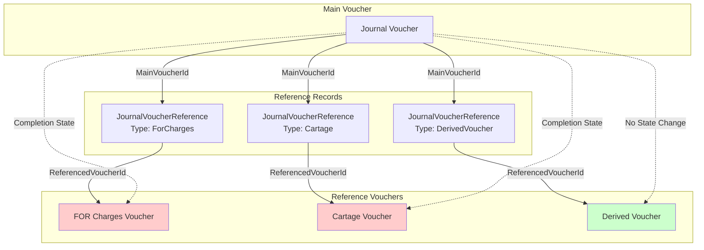
```mermaid
graph TB
    subgraph "Main Voucher"
        MV[Journal Voucher]
    end
    
    subgraph "Reference Vouchers"
        FOR[FOR Charges Voucher]
        CART[Cartage Voucher]
        DER[Derived Voucher]
    end
    
    subgraph "Reference Records"
        REF1[JournalVoucherReference<br/>Type: ForCharges]
        REF2[JournalVoucherReference<br/>Type: Cartage]
        REF3[JournalVoucherReference<br/>Type: DerivedVoucher]
    end
    
    MV -->|MainVoucherId| REF1
    MV -->|MainVoucherId| REF2
    MV -->|MainVoucherId| REF3
    
    REF1 -->|ReferencedVoucherId| FOR
    REF2 -->|ReferencedVoucherId| CART
    REF3 -->|ReferencedVoucherId| DER
    
    MV -.->|Completion State| FOR
    MV -.->|Completion State| CART
    MV -.->|No State Change| DER
    
    style FOR fill:#ffcccc
    style CART fill:#ffcccc
    style DER fill:#ccffcc
```

### Reference Lifecycle

**ForCharges & Cartage:**

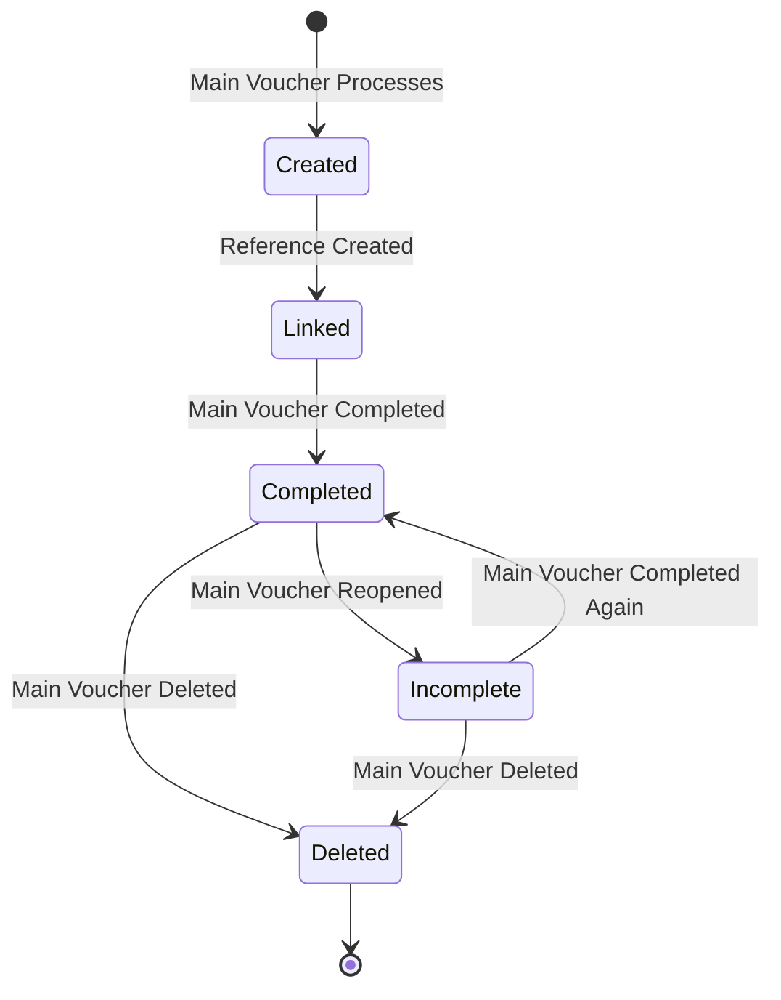
```mermaid
stateDiagram-v2
    [*] --> Created: Main Voucher Processes
    Created --> Linked: Reference Created
    Linked --> Completed: Main Voucher Completed
    Completed --> Incomplete: Main Voucher Reopened
    Incomplete --> Completed: Main Voucher Completed Again
    Completed --> Deleted: Main Voucher Deleted
    Incomplete --> Deleted: Main Voucher Deleted
    Deleted --> [*]
```

**DerivedVoucher:**

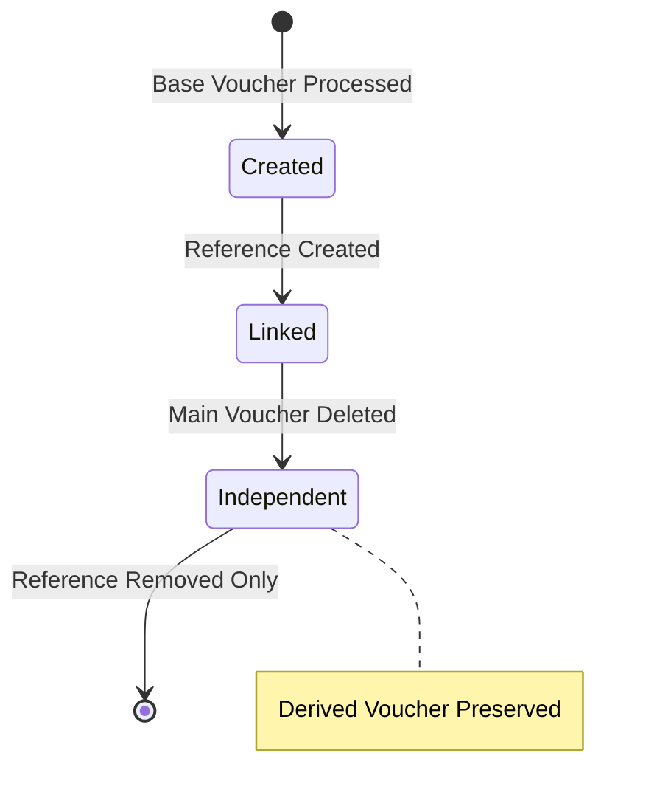
```mermaid
stateDiagram-v2
    [*] --> Created: Base Voucher Processed
    Created --> Linked: Reference Created
    Linked --> Independent: Main Voucher Deleted
    Independent --> [*]: Reference Removed Only
    Note right of Independent: Derived Voucher Preserved
```

---

## State Transitions

### Entry State Machine

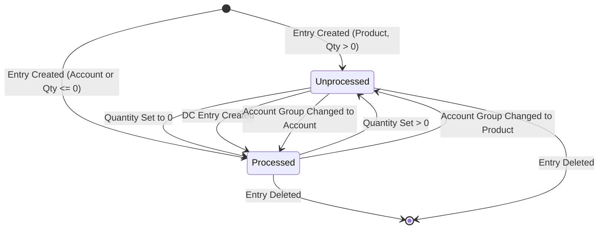
```mermaid
stateDiagram-v2
    [*] --> Unprocessed: Entry Created (Product, Qty > 0)
    [*] --> Processed: Entry Created (Account or Qty <= 0)
    
    Unprocessed --> Processed: Quantity Set to 0
    Unprocessed --> Processed: DC Entry Created
    Unprocessed --> Processed: Account Group Changed to Account
    
    Processed --> Unprocessed: Quantity Set > 0
    Processed --> Unprocessed: Account Group Changed to Product
    
    Processed --> [*]: Entry Deleted
    Unprocessed --> [*]: Entry Deleted
```

### Voucher State Machine

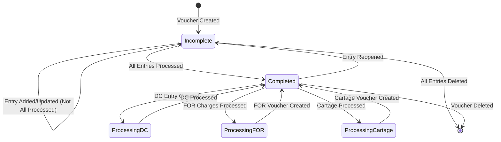
```mermaid
stateDiagram-v2
    [*] --> Incomplete: Voucher Created
    Incomplete --> Incomplete: Entry Added/Updated (Not All Processed)
    Incomplete --> Completed: All Entries Processed
    Completed --> Incomplete: Entry Reopened
    Completed --> ProcessingDC: DC Entry Created
    ProcessingDC --> Completed: DC Processed
    Completed --> ProcessingFOR: FOR Charges Processed
    ProcessingFOR --> Completed: FOR Voucher Created
    Completed --> ProcessingCartage: Cartage Processed
    ProcessingCartage --> Completed: Cartage Voucher Created
    Incomplete --> [*]: All Entries Deleted
    Completed --> [*]: Voucher Deleted
```

### Base Voucher Processing States

```mermaid
stateDiagram-v2
    [*] --> Base: Voucher Created as Base
    Base --> Base: Entry Added/Updated
    Base --> Processing: Derived Voucher Created
    Processing --> Base: Partial Processing
    Processing --> Regular: Full Processing
    Base --> Regular: Converted to Regular
    Regular --> [*]: Voucher Deleted
    Base --> [*]: Voucher Deleted
```

---

## Data Flow Diagrams

### Complete Entry Processing Flow

```mermaid
flowchart TB
    subgraph "Entry Creation"
        A1[Create Entry] --> A2[Determine Processed Status]
        A2 --> A3{Account Group?}
        A3 -->|Account| A4[IsProcessed = True]
        A3 -->|Product| A5{Quantity > 0?}
        A5 -->|Yes| A6[IsProcessed = False]
        A5 -->|No| A7[IsProcessed = True]
    end
    
    subgraph "DC Processing"
        B1[Create DC Entry] --> B2[Mark Entry Processed]
        B2 --> B3[Update Voucher Completion]
    end
    
    subgraph "Voucher Completion"
        C1[Check All Entries] --> C2{All Processed?}
        C2 -->|Yes| C3[Set IsCompleted = True]
        C2 -->|No| C4[Set IsCompleted = False]
        C3 --> C5[Complete Reference Vouchers]
        C4 --> C6[Reopen Reference Vouchers]
    end
    
    A4 --> C1
    A6 --> B1
    A7 --> C1
    B3 --> C1
```

---

## Error Handling Flows

### Transaction Rollback Scenarios

```mermaid
flowchart TD
    Start([Operation Start]) --> BeginTx[Begin Transaction]
    BeginTx --> Operation[Perform Operation]
    Operation --> CheckError{Error Occurred?}
    CheckError -->|No| SaveChanges[Save Changes]
    SaveError{Save Error?}
    SaveChanges --> SaveError
    SaveError -->|No| Commit[Commit Transaction]
    Commit --> CommitError{Commit Error?}
    CommitError -->|No| Success[Return Success]
    CommitError -->|Yes| Rollback1[Rollback Transaction]
    SaveError -->|Yes| Rollback2[Rollback Transaction]
    CheckError -->|Yes| Rollback3[Rollback Transaction]
    Rollback1 --> LogError[Log Error]
    Rollback2 --> LogError
    Rollback3 --> LogError
    LogError --> ReturnError[Return Error]
    
    style Rollback1 fill:#ffcccc
    style Rollback2 fill:#ffcccc
    style Rollback3 fill:#ffcccc
    style Success fill:#ccffcc
```

---

**Document Version:** 1.0  
**Last Updated:** 2024-12-19  
**Next Review:** After critical fixes

